# ACTIVITY DIAGRAMS – TASKHERO (22 sơ đồ)

---
## UC-01 | Admin – Đăng nhập

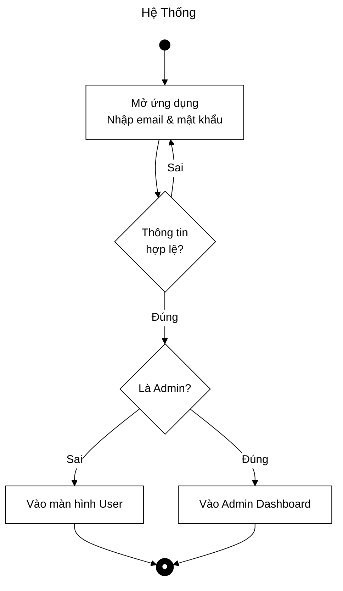
```mermaid
---
title: Hệ Thống
---
%%{init: {'theme':'base', 'themeVariables': {'primaryColor':'#ffffff', 'primaryBorderColor':'#000000', 'primaryTextColor':'#000000', 'lineColor':'#000000', 'edgeLabelBackground':'#ffffff', 'tertiaryColor':'#ffffff'}}}%%
flowchart TD
    classDef default fill:#ffffff,stroke:#000000,stroke-width:1px,color:#000000;
    classDef blackNode fill:#000000,stroke:#000000,stroke-width:1px,color:#ffffff;
    S(( )):::blackNode --> A[Mở ứng dụng\nNhập email & mật khẩu]
    A --> D1{Thông tin\nhợp lệ?}
    D1 -- Sai --> A
    D1 -- Đúng --> D2{Là Admin?}
    D2 -- Sai --> B[Vào màn hình User]
    D2 -- Đúng --> C[Vào Admin Dashboard]
    B --> E((●)):::blackNode
    C --> E
```

---
## UC-02 | Admin – Xem & tìm kiếm người dùng

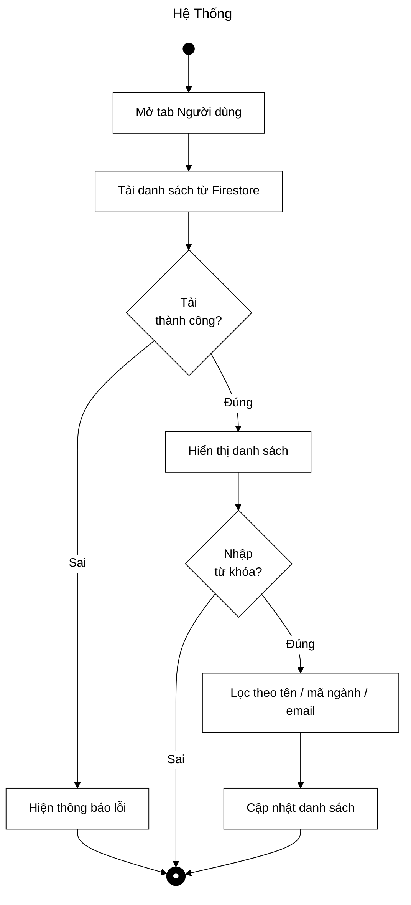
```mermaid
---
title: Hệ Thống
---
%%{init: {'theme':'base', 'themeVariables': {'primaryColor':'#ffffff', 'primaryBorderColor':'#000000', 'primaryTextColor':'#000000', 'lineColor':'#000000', 'edgeLabelBackground':'#ffffff', 'tertiaryColor':'#ffffff'}}}%%
flowchart TD
    classDef default fill:#ffffff,stroke:#000000,stroke-width:1px,color:#000000;
    classDef blackNode fill:#000000,stroke:#000000,stroke-width:1px,color:#ffffff;
    S(( )):::blackNode --> A[Mở tab Người dùng]
    A --> B[Tải danh sách từ Firestore]
    B --> D1{Tải\nthành công?}
    D1 -- Sai --> X[Hiện thông báo lỗi]
    X --> E((●)):::blackNode
    D1 -- Đúng --> C[Hiển thị danh sách]
    C --> D2{Nhập\ntừ khóa?}
    D2 -- Sai --> E
    D2 -- Đúng --> F[Lọc theo tên / mã ngành / email]
    F --> G[Cập nhật danh sách]
    G --> E
```

---
## UC-03 | Admin – Xem chi tiết người dùng

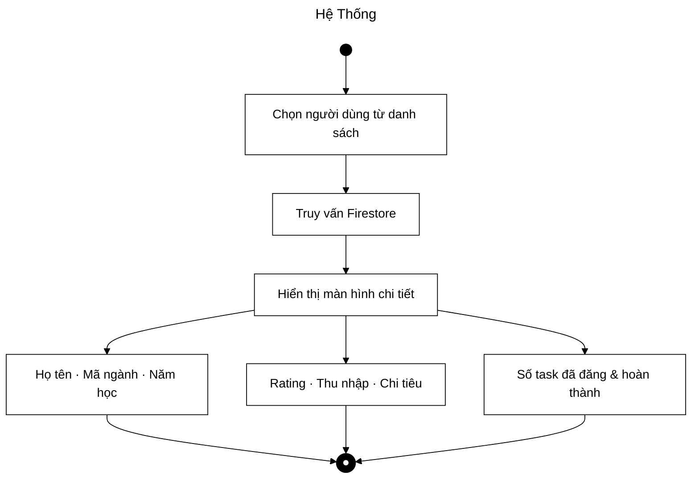
```mermaid
---
title: Hệ Thống
---
%%{init: {'theme':'base', 'themeVariables': {'primaryColor':'#ffffff', 'primaryBorderColor':'#000000', 'primaryTextColor':'#000000', 'lineColor':'#000000', 'edgeLabelBackground':'#ffffff', 'tertiaryColor':'#ffffff'}}}%%
flowchart TD
    classDef default fill:#ffffff,stroke:#000000,stroke-width:1px,color:#000000;
    classDef blackNode fill:#000000,stroke:#000000,stroke-width:1px,color:#ffffff;
    S(( )):::blackNode --> A[Chọn người dùng từ danh sách]
    A --> B[Truy vấn Firestore]
    B --> C[Hiển thị màn hình chi tiết]
    C --> D[Họ tên · Mã ngành · Năm học]
    C --> E[Rating · Thu nhập · Chi tiêu]
    C --> F[Số task đã đăng & hoàn thành]
    D & E & F --> Z((●)):::blackNode
```

---
## UC-04 | Admin – Xem thống kê hệ thống

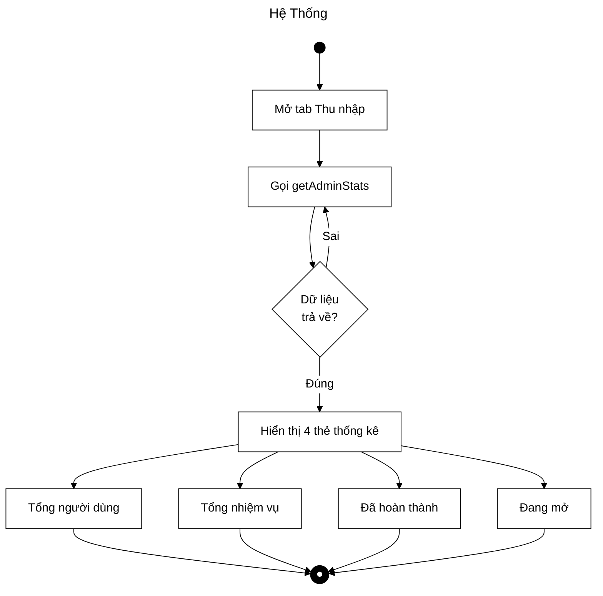
```mermaid
---
title: Hệ Thống
---
%%{init: {'theme':'base', 'themeVariables': {'primaryColor':'#ffffff', 'primaryBorderColor':'#000000', 'primaryTextColor':'#000000', 'lineColor':'#000000', 'edgeLabelBackground':'#ffffff', 'tertiaryColor':'#ffffff'}}}%%
flowchart TD
    classDef default fill:#ffffff,stroke:#000000,stroke-width:1px,color:#000000;
    classDef blackNode fill:#000000,stroke:#000000,stroke-width:1px,color:#ffffff;
    S(( )):::blackNode --> A[Mở tab Thu nhập]
    A --> B[Gọi getAdminStats]
    B --> D1{Dữ liệu\ntrả về?}
    D1 -- Sai --> B
    D1 -- Đúng --> C[Hiển thị 4 thẻ thống kê]
    C --> G[Tổng người dùng]
    C --> H[Tổng nhiệm vụ]
    C --> I[Đã hoàn thành]
    C --> J[Đang mở]
    G & H & I & J --> Z((●)):::blackNode
```

---
## UC-05 | Admin – Xem doanh thu nền tảng

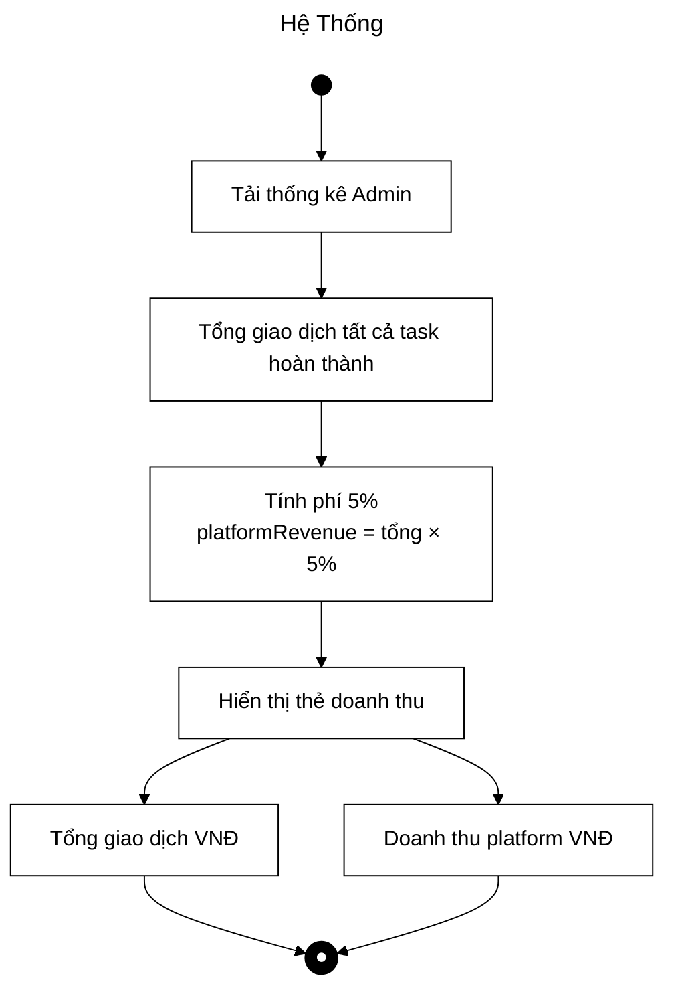
```mermaid
---
title: Hệ Thống
---
%%{init: {'theme':'base', 'themeVariables': {'primaryColor':'#ffffff', 'primaryBorderColor':'#000000', 'primaryTextColor':'#000000', 'lineColor':'#000000', 'edgeLabelBackground':'#ffffff', 'tertiaryColor':'#ffffff'}}}%%
flowchart TD
    classDef default fill:#ffffff,stroke:#000000,stroke-width:1px,color:#000000;
    classDef blackNode fill:#000000,stroke:#000000,stroke-width:1px,color:#ffffff;
    S(( )):::blackNode --> A[Tải thống kê Admin]
    A --> B[Tổng giao dịch tất cả task hoàn thành]
    B --> C[Tính phí 5%\nplatformRevenue = tổng × 5%]
    C --> D[Hiển thị thẻ doanh thu]
    D --> E[Tổng giao dịch VNĐ]
    D --> F[Doanh thu platform VNĐ]
    E & F --> Z((●)):::blackNode
```

---
## UC-06 | Admin – Xem bảng xếp hạng

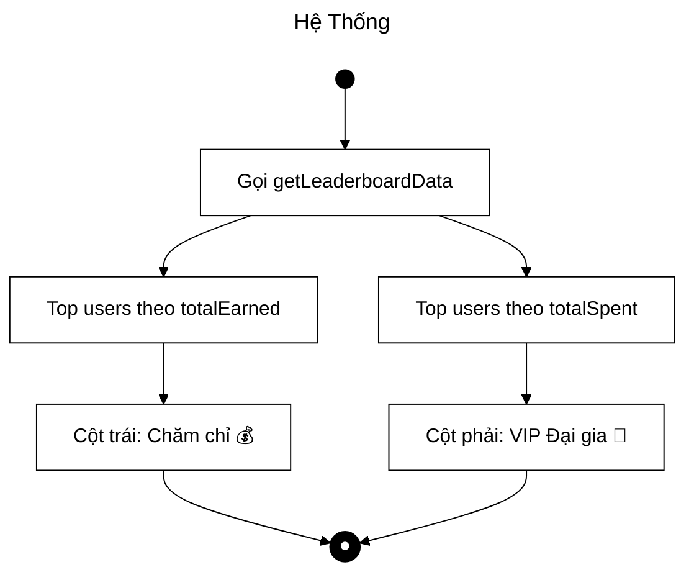
```mermaid
---
title: Hệ Thống
---
%%{init: {'theme':'base', 'themeVariables': {'primaryColor':'#ffffff', 'primaryBorderColor':'#000000', 'primaryTextColor':'#000000', 'lineColor':'#000000', 'edgeLabelBackground':'#ffffff', 'tertiaryColor':'#ffffff'}}}%%
flowchart TD
    classDef default fill:#ffffff,stroke:#000000,stroke-width:1px,color:#000000;
    classDef blackNode fill:#000000,stroke:#000000,stroke-width:1px,color:#ffffff;
    S(( )):::blackNode --> A[Gọi getLeaderboardData]
    A --> B[Top users theo totalEarned]
    A --> C[Top users theo totalSpent]
    B --> D[Cột trái: Chăm chỉ 💰]
    C --> E[Cột phải: VIP Đại gia 💎]
    D & E --> Z((●)):::blackNode
```

---
## UC-07 | Admin – Xem lịch sử giao dịch

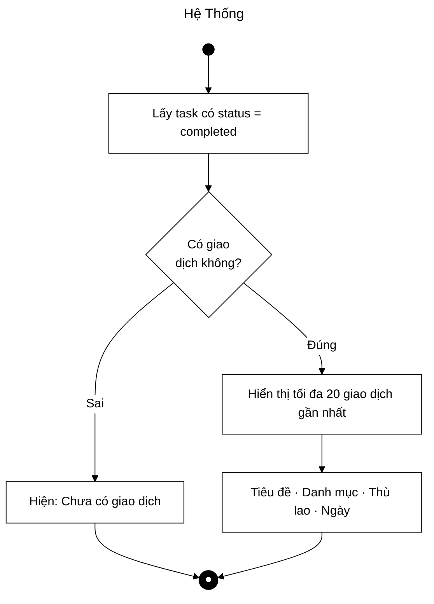
```mermaid
---
title: Hệ Thống
---
%%{init: {'theme':'base', 'themeVariables': {'primaryColor':'#ffffff', 'primaryBorderColor':'#000000', 'primaryTextColor':'#000000', 'lineColor':'#000000', 'edgeLabelBackground':'#ffffff', 'tertiaryColor':'#ffffff'}}}%%
flowchart TD
    classDef default fill:#ffffff,stroke:#000000,stroke-width:1px,color:#000000;
    classDef blackNode fill:#000000,stroke:#000000,stroke-width:1px,color:#ffffff;
    S(( )):::blackNode --> A[Lấy task có status = completed]
    A --> D1{Có giao\ndịch không?}
    D1 -- Sai --> B[Hiện: Chưa có giao dịch]
    D1 -- Đúng --> C[Hiển thị tối đa 20 giao dịch gần nhất]
    C --> D[Tiêu đề · Danh mục · Thù lao · Ngày]
    B & D --> Z((●)):::blackNode
```

---
## UC-08 | User – Đăng ký tài khoản

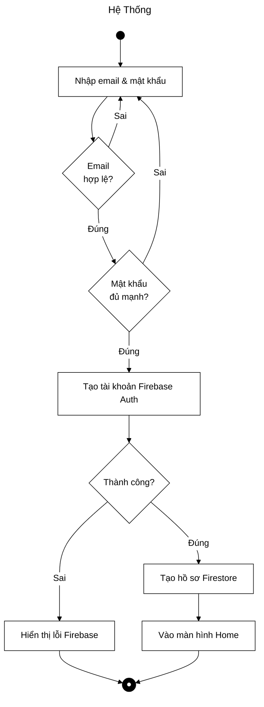
```mermaid
---
title: Hệ Thống
---
%%{init: {'theme':'base', 'themeVariables': {'primaryColor':'#ffffff', 'primaryBorderColor':'#000000', 'primaryTextColor':'#000000', 'lineColor':'#000000', 'edgeLabelBackground':'#ffffff', 'tertiaryColor':'#ffffff'}}}%%
flowchart TD
    classDef default fill:#ffffff,stroke:#000000,stroke-width:1px,color:#000000;
    classDef blackNode fill:#000000,stroke:#000000,stroke-width:1px,color:#ffffff;
    S(( )):::blackNode --> A[Nhập email & mật khẩu]
    A --> D1{Email\nhợp lệ?}
    D1 -- Sai --> A
    D1 -- Đúng --> D2{Mật khẩu\nđủ mạnh?}
    D2 -- Sai --> A
    D2 -- Đúng --> B[Tạo tài khoản Firebase Auth]
    B --> D3{Thành công?}
    D3 -- Sai --> C[Hiển thị lỗi Firebase]
    D3 -- Đúng --> D[Tạo hồ sơ Firestore]
    D --> E[Vào màn hình Home]
    C & E --> Z((●)):::blackNode
```

---
## UC-09 | User – Đăng nhập & Đăng xuất

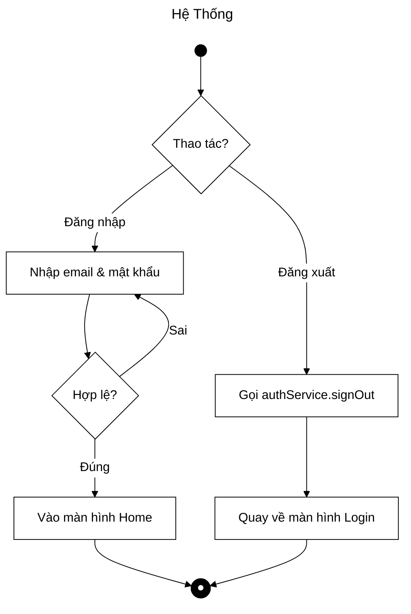
```mermaid
---
title: Hệ Thống
---
%%{init: {'theme':'base', 'themeVariables': {'primaryColor':'#ffffff', 'primaryBorderColor':'#000000', 'primaryTextColor':'#000000', 'lineColor':'#000000', 'edgeLabelBackground':'#ffffff', 'tertiaryColor':'#ffffff'}}}%%
flowchart TD
    classDef default fill:#ffffff,stroke:#000000,stroke-width:1px,color:#000000;
    classDef blackNode fill:#000000,stroke:#000000,stroke-width:1px,color:#ffffff;
    S(( )):::blackNode --> D0{Thao tác?}
    D0 -- Đăng nhập --> A[Nhập email & mật khẩu]
    A --> D1{Hợp lệ?}
    D1 -- Sai --> A
    D1 -- Đúng --> B[Vào màn hình Home]
    D0 -- Đăng xuất --> C[Gọi authService.signOut]
    C --> D[Quay về màn hình Login]
    B & D --> Z((●)):::blackNode
```

---
## UC-10 | User – Khôi phục mật khẩu

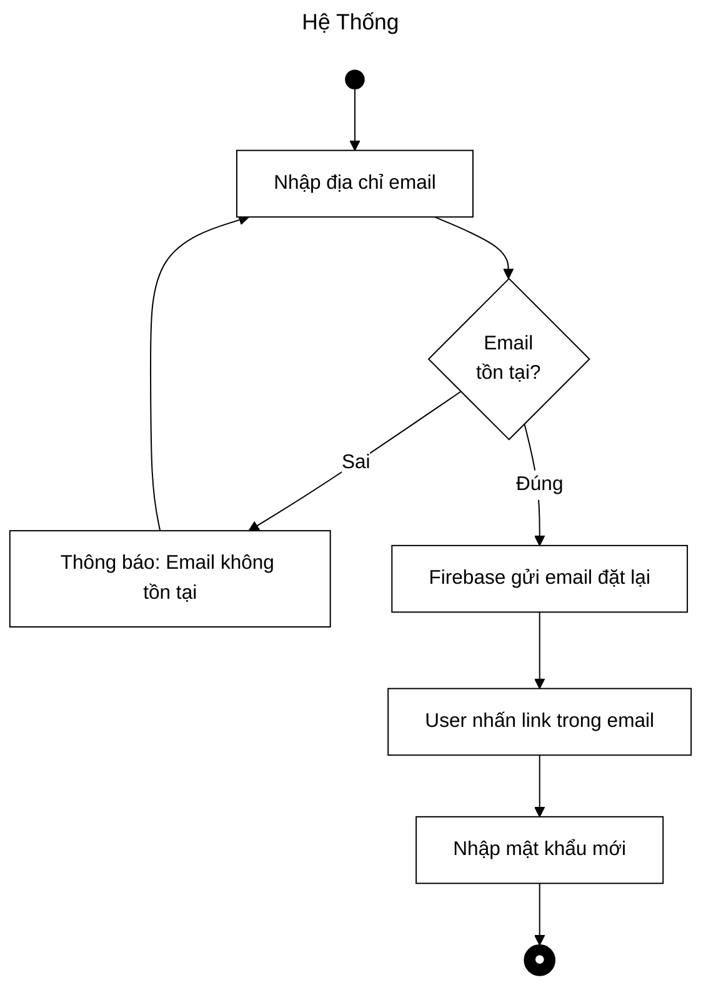
```mermaid
---
title: Hệ Thống
---
%%{init: {'theme':'base', 'themeVariables': {'primaryColor':'#ffffff', 'primaryBorderColor':'#000000', 'primaryTextColor':'#000000', 'lineColor':'#000000', 'edgeLabelBackground':'#ffffff', 'tertiaryColor':'#ffffff'}}}%%
flowchart TD
    classDef default fill:#ffffff,stroke:#000000,stroke-width:1px,color:#000000;
    classDef blackNode fill:#000000,stroke:#000000,stroke-width:1px,color:#ffffff;
    S(( )):::blackNode --> A[Nhập địa chỉ email]
    A --> D1{Email\ntồn tại?}
    D1 -- Sai --> X[Thông báo: Email không tồn tại]
    X --> A
    D1 -- Đúng --> B[Firebase gửi email đặt lại]
    B --> C[User nhấn link trong email]
    C --> D[Nhập mật khẩu mới]
    D --> Z((●)):::blackNode
```

---
## UC-11 | User – Cập nhật hồ sơ cá nhân

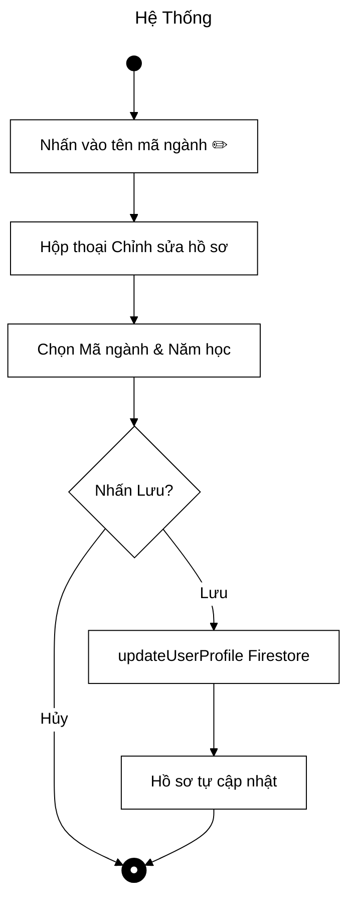
```mermaid
---
title: Hệ Thống
---
%%{init: {'theme':'base', 'themeVariables': {'primaryColor':'#ffffff', 'primaryBorderColor':'#000000', 'primaryTextColor':'#000000', 'lineColor':'#000000', 'edgeLabelBackground':'#ffffff', 'tertiaryColor':'#ffffff'}}}%%
flowchart TD
    classDef default fill:#ffffff,stroke:#000000,stroke-width:1px,color:#000000;
    classDef blackNode fill:#000000,stroke:#000000,stroke-width:1px,color:#ffffff;
    S(( )):::blackNode --> A[Nhấn vào tên mã ngành ✏️]
    A --> B[Hộp thoại Chỉnh sửa hồ sơ]
    B --> C[Chọn Mã ngành & Năm học]
    C --> D1{Nhấn Lưu?}
    D1 -- Hủy --> Z((●)):::blackNode
    D1 -- Lưu --> E[updateUserProfile Firestore]
    E --> F[Hồ sơ tự cập nhật]
    F --> Z
```

---
## UC-12 | User – Xem thống kê cá nhân

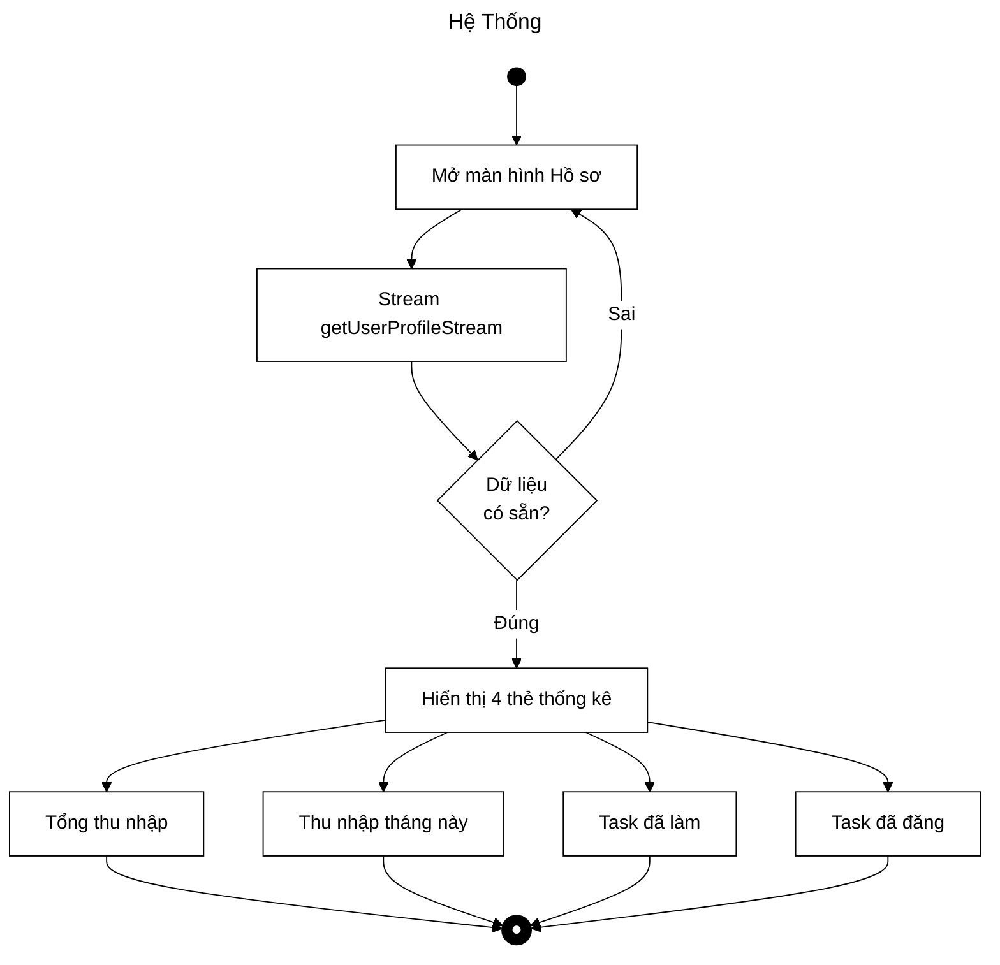
```mermaid
---
title: Hệ Thống
---
%%{init: {'theme':'base', 'themeVariables': {'primaryColor':'#ffffff', 'primaryBorderColor':'#000000', 'primaryTextColor':'#000000', 'lineColor':'#000000', 'edgeLabelBackground':'#ffffff', 'tertiaryColor':'#ffffff'}}}%%
flowchart TD
    classDef default fill:#ffffff,stroke:#000000,stroke-width:1px,color:#000000;
    classDef blackNode fill:#000000,stroke:#000000,stroke-width:1px,color:#ffffff;
    S(( )):::blackNode --> A[Mở màn hình Hồ sơ]
    A --> B[Stream getUserProfileStream]
    B --> D1{Dữ liệu\ncó sẵn?}
    D1 -- Sai --> A
    D1 -- Đúng --> C[Hiển thị 4 thẻ thống kê]
    C --> D[Tổng thu nhập]
    C --> E[Thu nhập tháng này]
    C --> F[Task đã làm]
    C --> G[Task đã đăng]
    D & E & F & G --> Z((●)):::blackNode
```

---
## UC-13 | Poster – Đăng việc bằng giọng nói (AI)

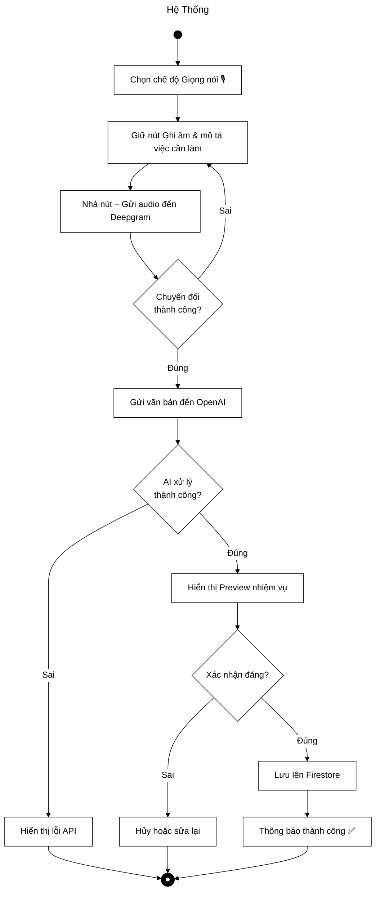
```mermaid
---
title: Hệ Thống
---
%%{init: {'theme':'base', 'themeVariables': {'primaryColor':'#ffffff', 'primaryBorderColor':'#000000', 'primaryTextColor':'#000000', 'lineColor':'#000000', 'edgeLabelBackground':'#ffffff', 'tertiaryColor':'#ffffff'}}}%%
flowchart TD
    classDef default fill:#ffffff,stroke:#000000,stroke-width:1px,color:#000000;
    classDef blackNode fill:#000000,stroke:#000000,stroke-width:1px,color:#ffffff;
    S(( )):::blackNode --> A[Chọn chế độ Giọng nói 🎙️]
    A --> B[Giữ nút Ghi âm & mô tả việc cần làm]
    B --> C[Nhả nút – Gửi audio đến Deepgram]
    C --> D1{Chuyển đổi\nthành công?}
    D1 -- Sai --> B
    D1 -- Đúng --> E[Gửi văn bản đến OpenAI]
    E --> D2{AI xử lý\nthành công?}
    D2 -- Sai --> X[Hiển thị lỗi API]
    D2 -- Đúng --> F[Hiển thị Preview nhiệm vụ]
    F --> D3{Xác nhận đăng?}
    D3 -- Sai --> G[Hủy hoặc sửa lại]
    D3 -- Đúng --> H[Lưu lên Firestore]
    H --> I[Thông báo thành công ✅]
    X & G & I --> Z((●)):::blackNode
```

---
## UC-14 | Poster – Đăng việc thủ công

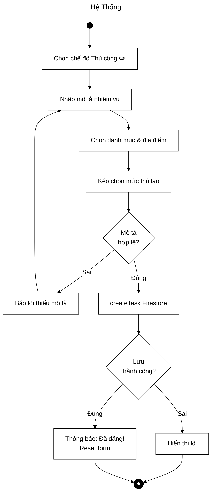
```mermaid
---
title: Hệ Thống
---
%%{init: {'theme':'base', 'themeVariables': {'primaryColor':'#ffffff', 'primaryBorderColor':'#000000', 'primaryTextColor':'#000000', 'lineColor':'#000000', 'edgeLabelBackground':'#ffffff', 'tertiaryColor':'#ffffff'}}}%%
flowchart TD
    classDef default fill:#ffffff,stroke:#000000,stroke-width:1px,color:#000000;
    classDef blackNode fill:#000000,stroke:#000000,stroke-width:1px,color:#ffffff;
    S(( )):::blackNode --> A[Chọn chế độ Thủ công ✏️]
    A --> B[Nhập mô tả nhiệm vụ]
    B --> C[Chọn danh mục & địa điểm]
    C --> D[Kéo chọn mức thù lao]
    D --> D1{Mô tả\nhợp lệ?}
    D1 -- Sai --> X[Báo lỗi thiếu mô tả]
    X --> B
    D1 -- Đúng --> E[createTask Firestore]
    E --> D2{Lưu\nthành công?}
    D2 -- Sai --> Y[Hiển thị lỗi]
    D2 -- Đúng --> F[Thông báo: Đã đăng!\nReset form]
    Y & F --> Z((●)):::blackNode
```

---
## UC-15 | Poster – Xem danh sách task đã đăng

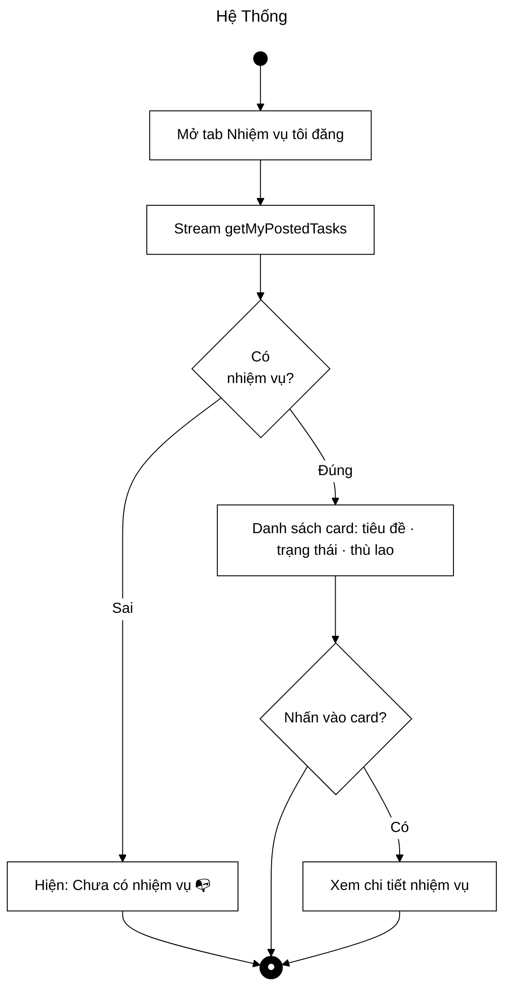
```mermaid
---
title: Hệ Thống
---
%%{init: {'theme':'base', 'themeVariables': {'primaryColor':'#ffffff', 'primaryBorderColor':'#000000', 'primaryTextColor':'#000000', 'lineColor':'#000000', 'edgeLabelBackground':'#ffffff', 'tertiaryColor':'#ffffff'}}}%%
flowchart TD
    classDef default fill:#ffffff,stroke:#000000,stroke-width:1px,color:#000000;
    classDef blackNode fill:#000000,stroke:#000000,stroke-width:1px,color:#ffffff;
    S(( )):::blackNode --> A[Mở tab Nhiệm vụ tôi đăng]
    A --> B[Stream getMyPostedTasks]
    B --> D1{Có\nnhiệm vụ?}
    D1 -- Sai --> C[Hiện: Chưa có nhiệm vụ 📭]
    D1 -- Đúng --> D[Danh sách card: tiêu đề · trạng thái · thù lao]
    D --> D2{Nhấn vào card?}
    D2 -- Có --> E[Xem chi tiết nhiệm vụ]
    C & D2 & E --> Z((●)):::blackNode
```

---
## UC-16 | Poster – Xác nhận thanh toán cho Hero

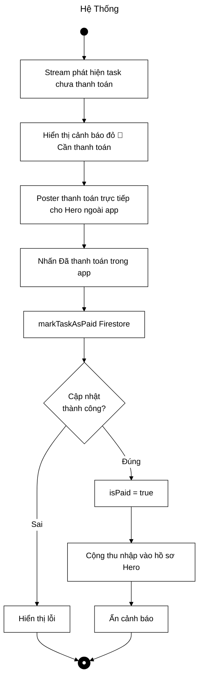
```mermaid
---
title: Hệ Thống
---
%%{init: {'theme':'base', 'themeVariables': {'primaryColor':'#ffffff', 'primaryBorderColor':'#000000', 'primaryTextColor':'#000000', 'lineColor':'#000000', 'edgeLabelBackground':'#ffffff', 'tertiaryColor':'#ffffff'}}}%%
flowchart TD
    classDef default fill:#ffffff,stroke:#000000,stroke-width:1px,color:#000000;
    classDef blackNode fill:#000000,stroke:#000000,stroke-width:1px,color:#ffffff;
    S(( )):::blackNode --> A[Stream phát hiện task chưa thanh toán]
    A --> B[Hiển thị cảnh báo đỏ 🔔 Cần thanh toán]
    B --> C[Poster thanh toán trực tiếp cho Hero ngoài app]
    C --> D[Nhấn Đã thanh toán trong app]
    D --> E[markTaskAsPaid Firestore]
    E --> D1{Cập nhật\nthành công?}
    D1 -- Sai --> F[Hiển thị lỗi]
    D1 -- Đúng --> G[isPaid = true]
    G --> H[Cộng thu nhập vào hồ sơ Hero]
    H --> I[Ẩn cảnh báo]
    F & I --> Z((●)):::blackNode
```

---
## UC-17 | Hero – Duyệt danh sách nhiệm vụ mở

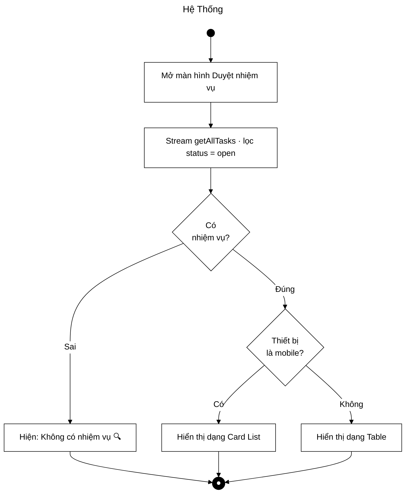
```mermaid
---
title: Hệ Thống
---
%%{init: {'theme':'base', 'themeVariables': {'primaryColor':'#ffffff', 'primaryBorderColor':'#000000', 'primaryTextColor':'#000000', 'lineColor':'#000000', 'edgeLabelBackground':'#ffffff', 'tertiaryColor':'#ffffff'}}}%%
flowchart TD
    classDef default fill:#ffffff,stroke:#000000,stroke-width:1px,color:#000000;
    classDef blackNode fill:#000000,stroke:#000000,stroke-width:1px,color:#ffffff;
    S(( )):::blackNode --> A[Mở màn hình Duyệt nhiệm vụ]
    A --> B[Stream getAllTasks · lọc status = open]
    B --> D1{Có\nnhiệm vụ?}
    D1 -- Sai --> C[Hiện: Không có nhiệm vụ 🔍]
    D1 -- Đúng --> D2{Thiết bị\nlà mobile?}
    D2 -- Có --> E[Hiển thị dạng Card List]
    D2 -- Không --> F[Hiển thị dạng Table]
    C & E & F --> Z((●)):::blackNode
```

---
## UC-18 | Hero – Tìm kiếm nhiệm vụ theo từ khóa

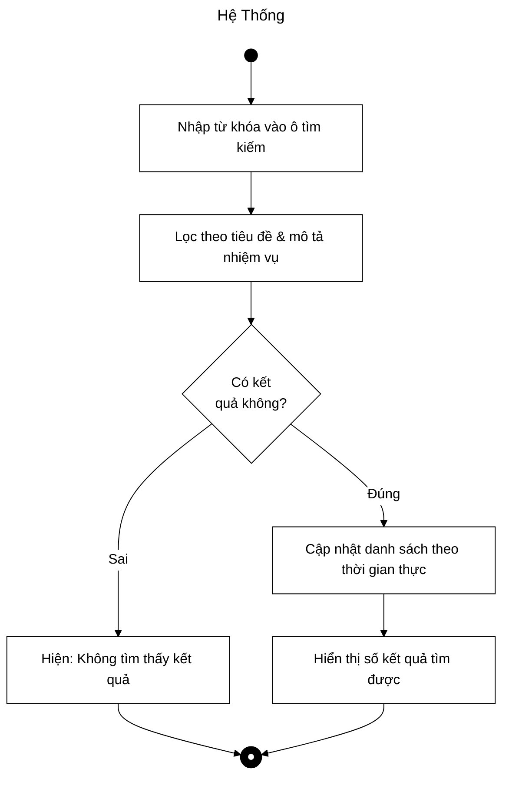
```mermaid
---
title: Hệ Thống
---
%%{init: {'theme':'base', 'themeVariables': {'primaryColor':'#ffffff', 'primaryBorderColor':'#000000', 'primaryTextColor':'#000000', 'lineColor':'#000000', 'edgeLabelBackground':'#ffffff', 'tertiaryColor':'#ffffff'}}}%%
flowchart TD
    classDef default fill:#ffffff,stroke:#000000,stroke-width:1px,color:#000000;
    classDef blackNode fill:#000000,stroke:#000000,stroke-width:1px,color:#ffffff;
    S(( )):::blackNode --> A[Nhập từ khóa vào ô tìm kiếm]
    A --> B[Lọc theo tiêu đề & mô tả nhiệm vụ]
    B --> D1{Có kết\nquả không?}
    D1 -- Sai --> C[Hiện: Không tìm thấy kết quả]
    D1 -- Đúng --> D[Cập nhật danh sách theo thời gian thực]
    D --> E[Hiển thị số kết quả tìm được]
    C & E --> Z((●)):::blackNode
```

---
## UC-19 | Hero – Lọc nhiệm vụ theo danh mục

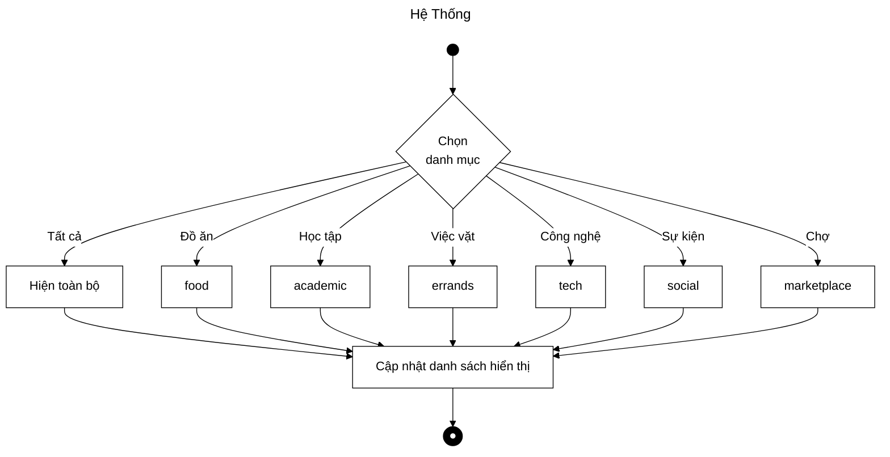
```mermaid
---
title: Hệ Thống
---
%%{init: {'theme':'base', 'themeVariables': {'primaryColor':'#ffffff', 'primaryBorderColor':'#000000', 'primaryTextColor':'#000000', 'lineColor':'#000000', 'edgeLabelBackground':'#ffffff', 'tertiaryColor':'#ffffff'}}}%%
flowchart TD
    classDef default fill:#ffffff,stroke:#000000,stroke-width:1px,color:#000000;
    classDef blackNode fill:#000000,stroke:#000000,stroke-width:1px,color:#ffffff;
    S(( )):::blackNode --> D1{Chọn\ndanh mục}
    D1 -- Tất cả --> A[Hiện toàn bộ]
    D1 -- Đồ ăn --> B[food]
    D1 -- Học tập --> C[academic]
    D1 -- Việc vặt --> D[errands]
    D1 -- Công nghệ --> E[tech]
    D1 -- Sự kiện --> F[social]
    D1 -- Chợ --> G[marketplace]
    A & B & C & D & E & F & G --> H[Cập nhật danh sách hiển thị]
    H --> Z((●)):::blackNode
```

---
## UC-20 | Hero – Nhận thực hiện nhiệm vụ

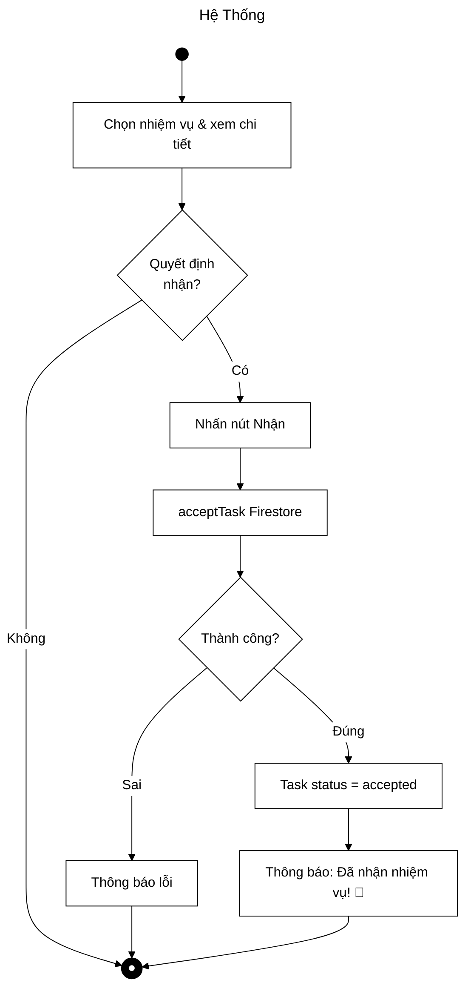
```mermaid
---
title: Hệ Thống
---
%%{init: {'theme':'base', 'themeVariables': {'primaryColor':'#ffffff', 'primaryBorderColor':'#000000', 'primaryTextColor':'#000000', 'lineColor':'#000000', 'edgeLabelBackground':'#ffffff', 'tertiaryColor':'#ffffff'}}}%%
flowchart TD
    classDef default fill:#ffffff,stroke:#000000,stroke-width:1px,color:#000000;
    classDef blackNode fill:#000000,stroke:#000000,stroke-width:1px,color:#ffffff;
    S(( )):::blackNode --> A[Chọn nhiệm vụ & xem chi tiết]
    A --> D1{Quyết định\nnhận?}
    D1 -- Không --> Z((●)):::blackNode
    D1 -- Có --> B[Nhấn nút Nhận]
    B --> C[acceptTask Firestore]
    C --> D2{Thành công?}
    D2 -- Sai --> E[Thông báo lỗi]
    D2 -- Đúng --> F[Task status = accepted]
    F --> G[Thông báo: Đã nhận nhiệm vụ! 🎉]
    E & G --> Z
```

---
## UC-21 | Hero – Xem danh sách task đang nhận

```mermaid
---
title: Hệ Thống
---
%%{init: {'theme':'base', 'themeVariables': {'primaryColor':'#ffffff', 'primaryBorderColor':'#000000', 'primaryTextColor':'#000000', 'lineColor':'#000000', 'edgeLabelBackground':'#ffffff', 'tertiaryColor':'#ffffff'}}}%%
flowchart TD
    classDef default fill:#ffffff,stroke:#000000,stroke-width:1px,color:#000000;
    classDef blackNode fill:#000000,stroke:#000000,stroke-width:1px,color:#ffffff;
    S(( )):::blackNode --> A[Mở tab Nhiệm vụ tôi nhận]
    A --> B[Stream getMyAcceptedTasks]
    B --> D1{Có\nnhiệm vụ?}
    D1 -- Sai --> C[Hiện: Chưa có nhiệm vụ 📭]
    D1 -- Đúng --> D[Danh sách: tiêu đề · trạng thái · thù lao]
    D --> D2{Nhấn card?}
    D2 -- Có --> E[Xem chi tiết nhiệm vụ]
    C & D2 & E --> Z((●)):::blackNode
```

---
## UC-22 | Hero – Xem thu nhập & trạng thái thanh toán

```mermaid
---
title: Hệ Thống
---
%%{init: {'theme':'base', 'themeVariables': {'primaryColor':'#ffffff', 'primaryBorderColor':'#000000', 'primaryTextColor':'#000000', 'lineColor':'#000000', 'edgeLabelBackground':'#ffffff', 'tertiaryColor':'#ffffff'}}}%%
flowchart TD
    classDef default fill:#ffffff,stroke:#000000,stroke-width:1px,color:#000000;
    classDef blackNode fill:#000000,stroke:#000000,stroke-width:1px,color:#ffffff;
    S(( )):::blackNode --> A[Mở màn hình Hồ sơ]
    A --> B[Stream getUserProfileStream]
    B --> C[Tổng thu nhập & Thu nhập tháng này]
    C --> D1{Có task\nchờ thanh toán?}
    D1 -- Sai --> E[Không hiển thị cảnh báo]
    D1 -- Đúng --> F[Danh sách task chờ Poster xác nhận]
    F --> G[Tên task · Tên Poster · Số tiền · Trạng thái]
    E & G --> Z((●)):::blackNode
```

---

> **Chú giải ký hiệu:**
>
> | Ký hiệu | Ý nghĩa |
> |:---:|:---|
> | `(( ))` | Điểm bắt đầu – hình tròn đặc |
> | `((●))` | Điểm kết thúc – hình tròn đặc viền ngoài |
> | `[...]` | Hoạt động (Activity) |
> | `{...}` | Quyết định (Decision) |
> | `-- Đúng/Sai -->` | Luồng điều khiển có nhãn |
