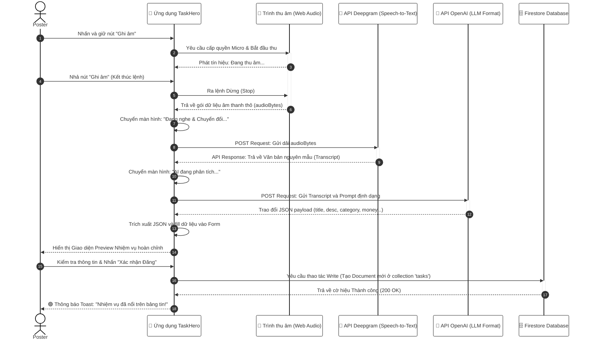

## 3.2. Thiết kế Luồng xử lý (Quy trình Nghiệp vụ)

Để đảm bảo các yêu cầu chức năng (Chương 2) được thiết kế và triển khai chính xác, ứng dụng TaskHero được bóc tách thành **8 module chức năng lõi**. Mỗi module chứa các luồng nghiệp vụ được biểu diễn thông qua Sơ đồ Tuần tự (Sequence Diagram) để mô tả tương tác hệ thống và Sơ đồ Hoạt động (Activity Diagram) để diễn giải dòng tư duy logic của người dùng.

### Bảng Phân rã 8 Module Chức năng Cốt lõi

| Nhóm chức năng (Module) | Quản lý quy trình nghiệp vụ (Nội dung chi tiết) |
| :--- | :--- |
| **Xác thực Hệ thống** | Tự động hóa đăng ký, Đăng nhập an toàn, và Khôi phục/Đặt lại mật khẩu thông qua email (Firebase Auth). |
| **Quản lý Hồ sơ Sinh viên** | Số hóa thông tin thiết lập mã ngành, Cập nhật thông tin định danh (năm học), Theo dõi dữ liệu thống kê biến động cá nhân. |
| **Trợ lý AI Tạo Nhiệm vụ** | Module nâng cao: Ghi âm giọng nói, Deepgram AI Speech-to-text và OpenAI bóc tách tự động định dạng form công việc. |
| **Quản lý Quy trình Đăng việc** | Đăng việc thủ công đa danh mục, Quản lý tác vụ/trạng thái nhiệm vụ đã đăng từ phía người tìm Hero. |
| **Hệ thống Giao dịch & Thanh toán** | Quá trình kích hoạt xác nhận thanh toán thù lao hoàn thành, Tính toán độ phễu doanh thu và Phí dịch vụ platform. |
| **Động cơ Trình duyệt & Lọc** | Thuật toán truy xuất hệ thống danh sách đang mở, Lọc đa danh mục (Công nghệ, Học tập...), Tìm kiếm mở rộng đa trường. |
| **Nhận việc & Chuyển đổi Trạng thái** | Thuật toán xét duyệt chốt nhận nhiệm vụ của Hero, và Theo dõi báo cáo tiến độ các công việc hiện đang nhận. |
| **Giám sát Quản trị Hệ thống** | Admin Dashboard theo dõi quy mô nhiệm vụ toàn hệ thống, Sơ đồ tỷ trọng hoạt động và Quản lý Bảng xếp hạng thi đua User chăm chỉ. |

---

### Sơ đồ Tuần tự (Sequence Diagram): Đăng Nhiệm Vụ Bằng AI Giọng Nói

*Trong đồ án, đây được xem là luồng định tuyến dữ liệu phức tạp nhất của hệ thống, đòi hỏi sự giao tiếp khép kín, xử lý bất đồng bộ giữa Giao diện người dùng (App), API Thiết bị (Microphone), Dịch vụ Firebase và 2 Hệ thống AI độc lập (Deepgram và OpenAI).*

---

### Sơ đồ Hoạt động (Activity Diagram) mô tả 22 Use Case
*(Hệ thống sử dụng các Sơ đồ Hoạt động để đi sâu hơn vào logic hành vi người dùng trong ranh giới từng Module thao tác nghiệp vụ, bảo đảm tính khắt khe của UML hệ thống).*

[DÁN TOÀN BỘ CODE CỦA 22 SƠ ĐỒ Ở FILE ACTIVITY_DIAGRAMS.MD VÀO DƯỚI DÒNG NÀY ĐỂ HOÀN TẤT BÁO CÁO NHÉ]
