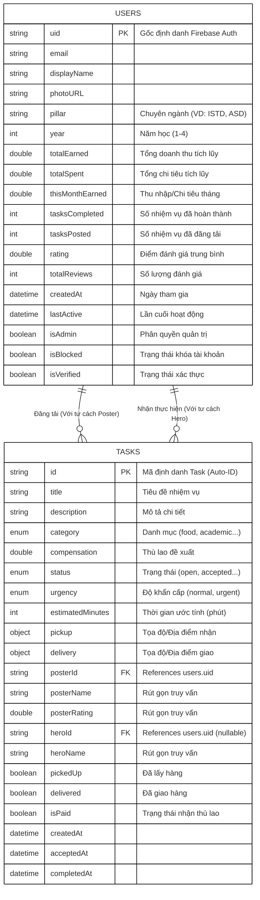

# CHƯƠNG 3: THIẾT KẾ HỆ THỐNG

## 3.1. Thiết kế Dữ liệu (Sơ đồ ERD Firebase / Class Diagram)

Hệ thống TaskHero sử dụng cơ sở dữ liệu **Cloud Firestore (NoSQL)**. Tuy nhiên, để biểu diễn cấu trúc dữ liệu một cách trực quan và chuẩn hóa theo góc nhìn thiết kế hướng đối tượng (OOP) và mối quan hệ thực thể, sơ đồ thực thể liên kết (ERD) hoặc Class Diagram dưới đây được sử dụng để định nghĩa cấu trúc của 2 Collection cốt lõi: `users` và `tasks`.

### Phân tích Thiết kế (Theo chuẩn NoSQL)

- **Nguyên lý Mối quan hệ**: Một `User` có thể đóng vai trò là `Poster` để tạo ra nhiều `Tasks` (1-N). Đồng thời, một `User` khác có thể đóng vai trò là `Hero` để nhận thực hiện nhiều `Tasks` (1-N).
- **Thiết kế Đảo ngược (Denormalization)**: Để tối ưu hóa hiệu suất đọc (Read operations) đặc trưng của Firestore NoSQL, bảng `tasks` chủ động lưu trữ bản sao của một số thông tin từ `users` như `posterName`, `posterRating`, và `heroName`. Điều này giúp hệ thống đổ dữ liệu lên màn hình Feed (Duyệt nhiệm vụ) một cách tức thì mà không cần phải thực hiện truy vấn N+1 (Fetch Task -> Fetch User).
