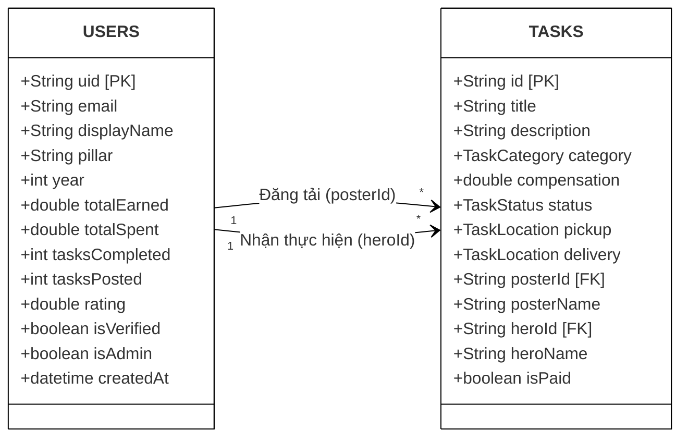

# CHƯƠNG 3: THIẾT KẾ HỆ THỐNG

## 3.1. Thiết kế Dữ liệu (Cấu trúc Collection Firebase)

Hệ thống TaskHero sử dụng cơ sở dữ liệu **Cloud Firestore (NoSQL)**. Cấu trúc dữ liệu bao gồm 2 Collection cốt lõi là `users` và `tasks`.

Dưới đây là sơ đồ mô hình hóa cấu trúc Document dưới dạng Sơ đồ Lớp (Class Diagram) để minh họa trực quan các trường dữ liệu và mối quan hệ bóc tách.

### Từ điển Dữ liệu (Data Dictionary)

Để triển khai lưu trữ trong Firestore, các thuộc tính được thiết kế cụ thể như sau:

**Bảng `USERS` (Lưu thông tin hồ sơ sinh viên)**

| Trường dữ liệu | Kiểu dữ liệu | Khóa | Ý nghĩa / Ghi chú |
| :--- | :--- | :---: | :--- |
| `uid` | String | **PK** | Mã định danh gốc do Firebase Auth cấp. |
| `email` | String | | Phải là email nội bộ (VD: đuôi @mymail.sutd.edu.sg). |
| `displayName` | String | | Họ tên đầy đủ của người dùng. |
| `pillar` | String | | Chuyên ngành học (ISTD, ASD, EPD...). |
| `year` | Integer | | Năm học của sinh viên (1 đến 4). |
| `totalEarned` | Double | | Tổng thu nhập bích lũy từ việc làm Hero. |
| `totalSpent` | Double | | Tổng chi phí đã trả cho việc đăng Task. |
| `tasksCompleted` | Integer | | Thống kê số nhiệm vụ đã hoàn thành tốt. |
| `rating` | Double | | Điểm đánh giá trung bình uy tín (1.0 - 5.0). |
| `isAdmin` | Boolean | | Đánh dấu tài khoản có quyền Quản trị viên. |

**Bảng `TASKS` (Lưu thông tin nhiệm vụ)**

| Trường dữ liệu | Kiểu dữ liệu | Khóa | Ý nghĩa / Ghi chú |
| :--- | :--- | :---: | :--- |
| `id` | String | **PK** | Mã định danh ngẫu nhiên (Auto-ID) của Task. |
| `title` | String | | Tiêu đề tóm tắt nhiệm vụ. |
| `category` | String/Enum | | Thuộc 6 danh mục (Food, Academic, Errands...). |
| `compensation` | Double | | Mức thù lao đề xuất quy ra VNĐ. |
| `status` | String/Enum | | Trạng thái (Open, Accepted, Completed, Cancelled). |
| `posterId` | String | **FK** | Tham chiếu đến `uid` của người đăng (Poster). |
| `heroId` | String | **FK** | Tham chiếu đến `uid` của người nhận (Hero). |
| `posterName` | String | | *Denormalization:* Tên người đăng để tăng tốc độ truy vấn đọc dữ liệu, không cần `join` bảng users. |
| `isPaid` | Boolean | | Cờ xác nhận Poster đã chuyển tiền cho Hero chưa. |

---
