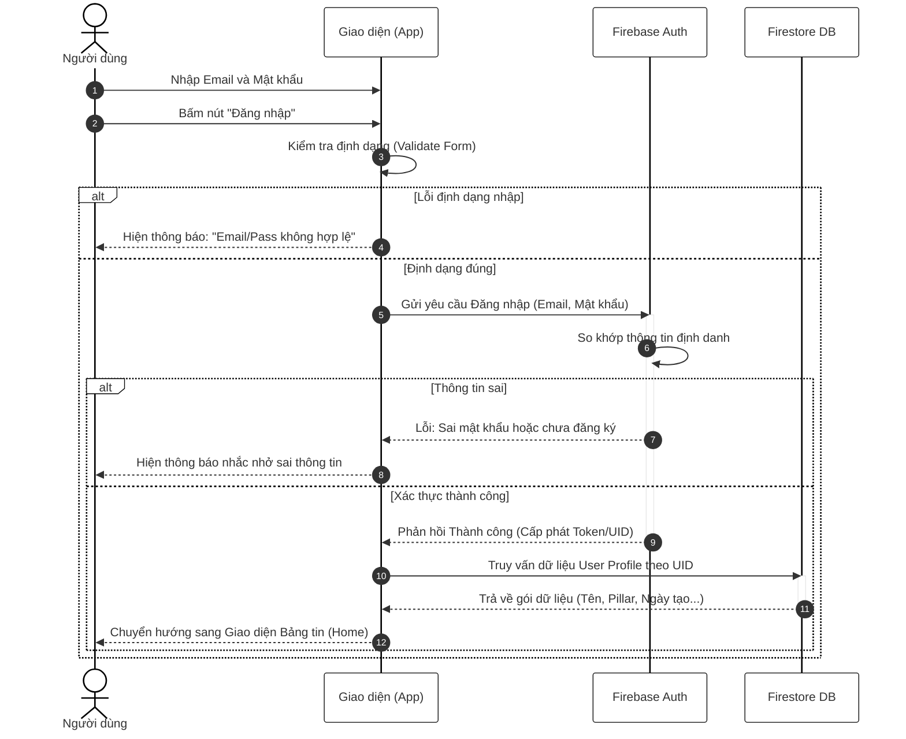
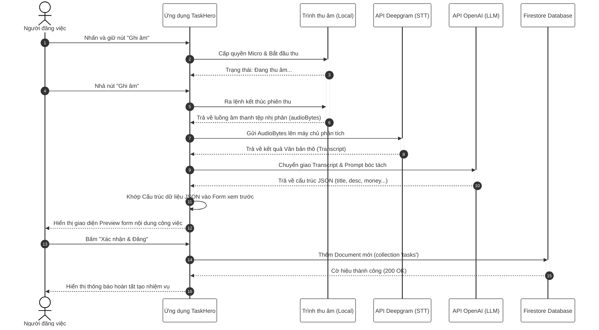
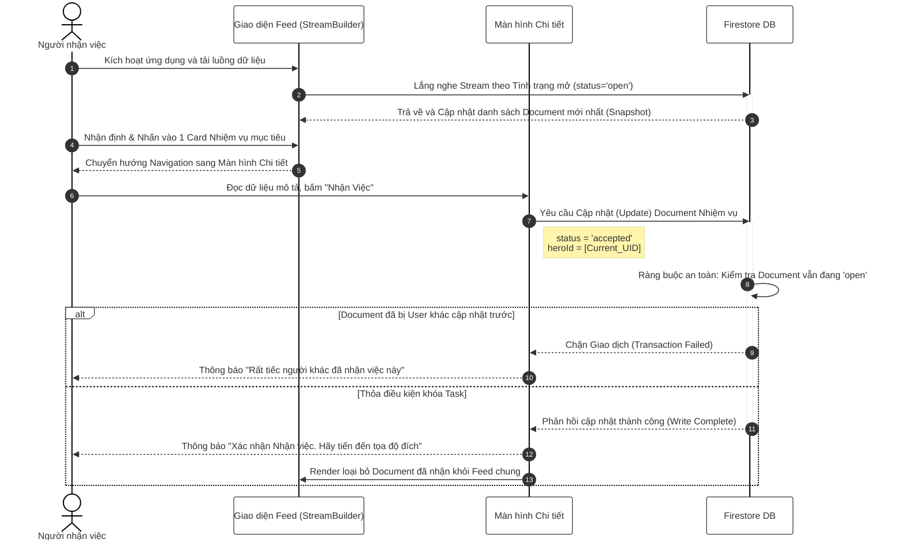
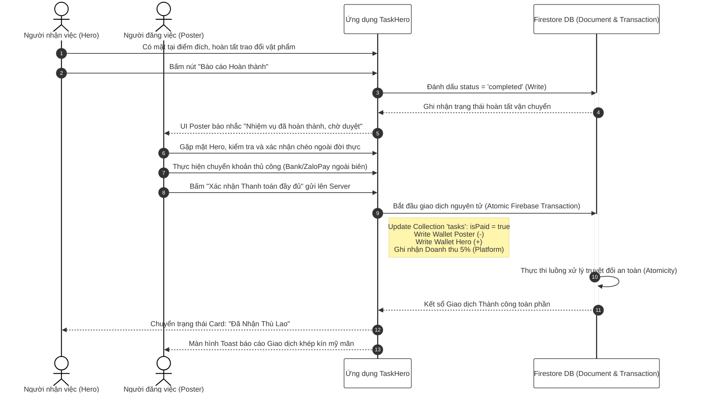

# CÁC SƠ ĐỒ TUẦN TỰ (SEQUENCE DIAGRAMS)
*(Bản dành riêng cho Báo cáo Đồ án, chuẩn học thuật, không chứa Emoji/Icon)*

## 1. Sơ đồ Tuần tự: Đăng nhập Hệ thống
Mô tả quá trình xác thực thông tin định danh của người dùng với cơ sở dữ liệu Firebase.

## 2. Sơ đồ Tuần tự: Đăng nhiệm vụ bằng Trí tuệ Nhân tạo (Voice AI)
Mô tả tiến trình nhận diện giọng nói và truyền tải dữ liệu đa kênh thông qua các API ngoại vi một cách bất đồng bộ.

## 3. Sơ đồ Tuần tự: Nhận nhiệm vụ (Hero Accept Task)
Mô tả quy trình tương tác giữa sinh viên chuyên nhận việc và hệ thống luồng dữ liệu thời gian thực.

## 4. Sơ đồ Tuần tự: Xác nhận Hoàn thành và Giao dịch thanh toán
Mô tả khâu xác nhận quyền lợi chéo giữa hai User (Poster và Hero) kèm theo sự thay đổi logic tài chính trong cơ sở dữ liệu.

