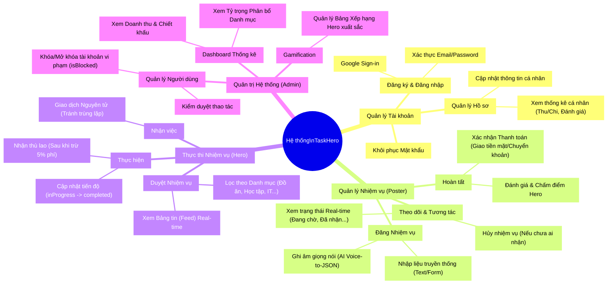

# Sơ đồ Phân rã Chức năng (Functional Decomposition Diagram - FDD)
Hệ thống Campus TaskHero

Dưới đây là Sơ đồ Phân rã Chức năng của hệ thống TaskHero được biểu diễn dưới dạng sơ đồ tư duy (Mindmap) và dạng danh sách phân cấp (Hierarchy).

## Biểu đồ Mermaid (Mindmap)
*Bạn có thể copy đoạn code này dán vào [Mermaid Live Editor](https://mermaid.live/) hoặc xem trực tiếp trên GitHub/GitLab, các trình Markdown có hỗ trợ Mermaid.*

---

## Dạng Danh sách Phân cấp (WBS - Work Breakdown Structure)

**1. Quản lý Tài khoản (Account Management)**
- 1.1 Đăng ký & Đăng nhập (Email, Google Auth)
- 1.2 Quản lý Hồ sơ (Thông tin sinh viên: Khoa, Năm học)
- 1.3 Xem Thống kê Cá nhân (Tổng thu/chi, Số Task đã làm)
- 1.4 Đặt lại Mật khẩu 

**2. Quản lý Nhiệm vụ dành cho Người đăng (Task Management for Poster)**
- 2.1 Tạo Nhiệm vụ bằng Form văn bản truyền thống
- 2.2 Tạo Nhiệm vụ bằng Giọng Nói AI (Voice-to-JSON qua Deepgram + OpenAI)
- 2.3 Theo dõi Trạng thái Nhiệm vụ (Real-time qua StreamBuilder)
- 2.4 Ủy quyền Thanh toán `isPaid` & Xác nhận hoàn thành
- 2.5 Đánh giá và Xếp hạng sao cho Hero (Rating)

**3. Thực thi Nhiệm vụ dành cho Hero (Task Execution for Hero)**
- 3.1 Xem Bảng tin (Feed) & Duyệt / Lọc theo Danh mục (Food, Tech, Study...)
- 3.2 Nhận Nhiệm vụ (Xử lý đồng thời qua Firestore Atomic Transaction)
- 3.3 Cập nhật tiến độ (`accepted` -> `inProgress` -> `completed`)
- 3.4 Quy trình nhận tiền thù lao (đã trừ 5% phí nền tảng)

**4. Quản trị Hệ thống (System Administration)**
- 4.1 Bảng điều khiển (Dashboard) Hiển thị biểu đồ luồng tiền & hoạt động
- 4.2 Quản lý Danh sách Người dùng (Xem chi tiết hồ sơ & Phân quyền)
- 4.3 Quản trị Bảo mật & Cấm tài khoản (Block users)
- 4.4 Hệ thống Thi đua Xếp hạng (Leaderboard) dành cho top sinh viên chăm chỉ
