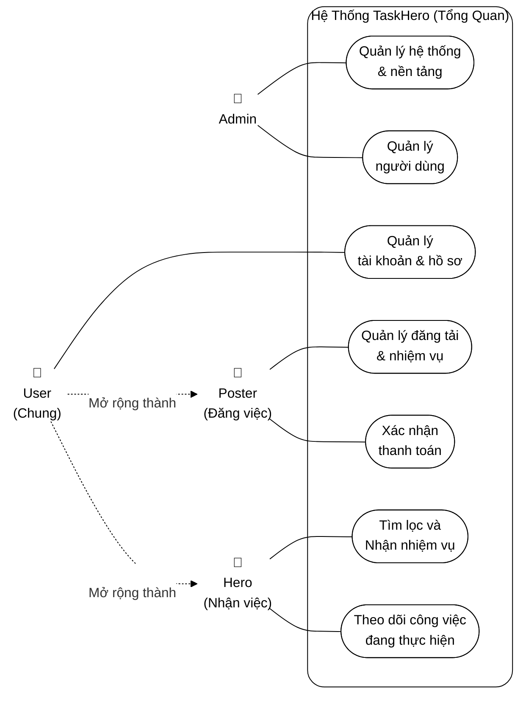
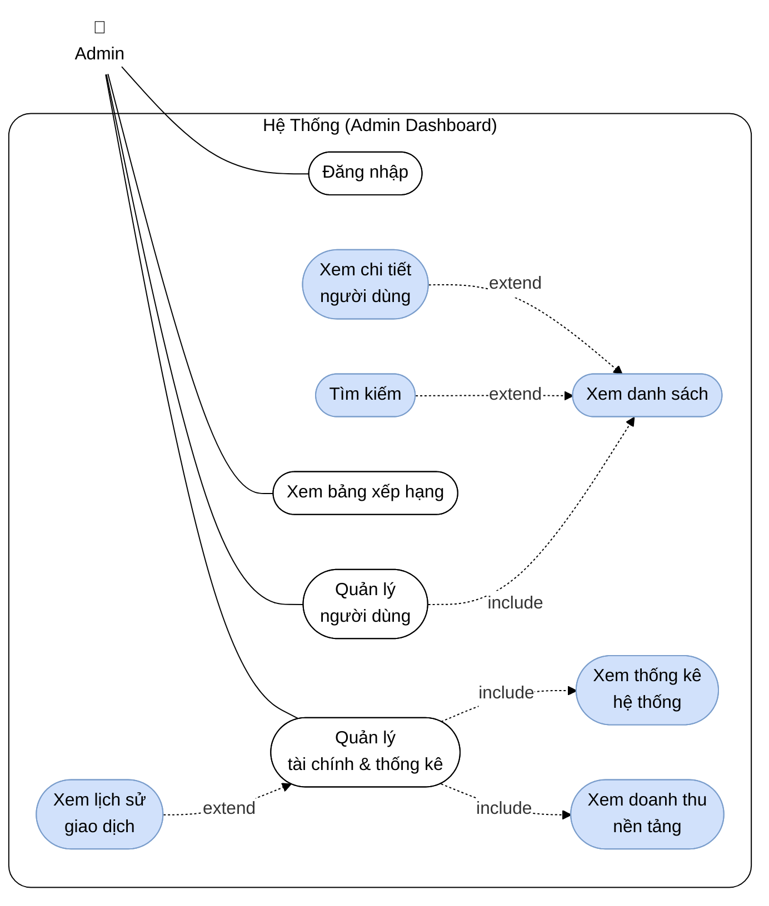
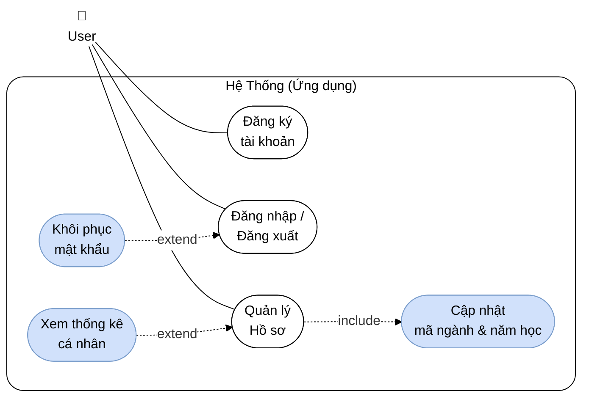
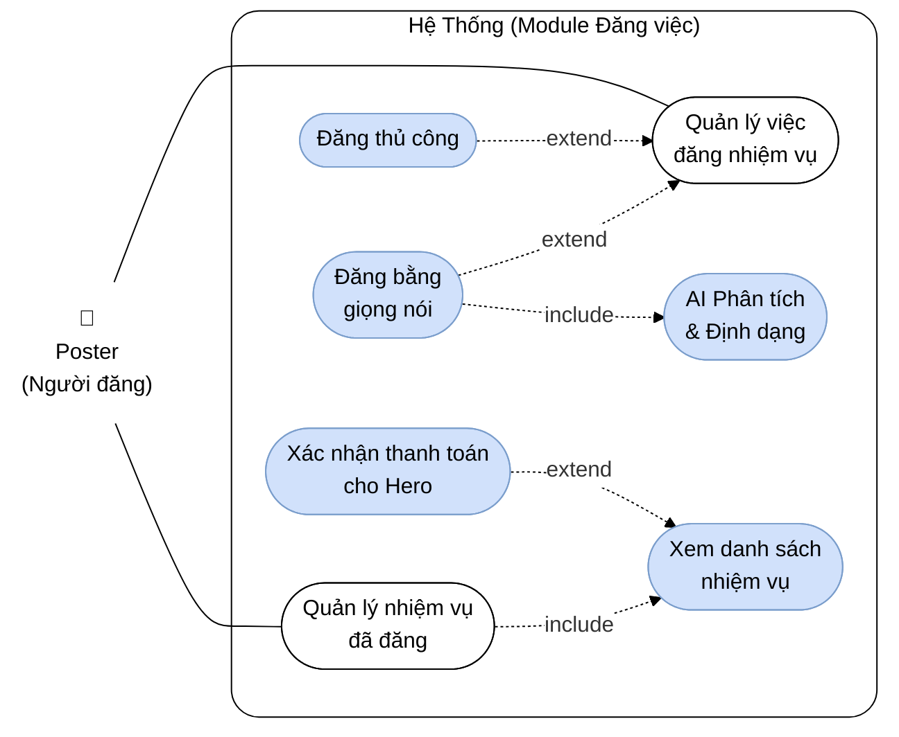
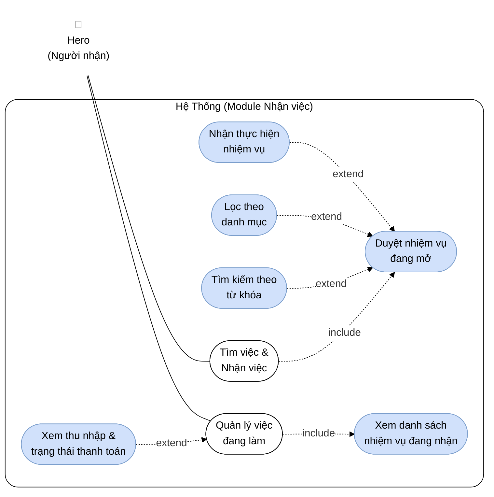

# SƠ ĐỒ USE CASE CHI TIẾT – HỆ THỐNG TASKHERO

> Các sơ đồ dưới đây mô phỏng chuẩn Use Case diagram của UML, với hệ thống mũi tên liên kết `include` (chức năng bắt buộc/gộp), `extend` (chức năng mở rộng) và khung `Hệ Thống` bao quát, được chia thành phần Tổng quát và 4 nhóm cụ thể tương ứng với 4 nhóm Actor chính, tóm gọn 22 Use Case.

---

## SƠ ĐỒ USE CASE TỔNG QUÁT Toàn Hệ Thống

---

## 1. Mục tiêu Tác nhân ADMIN (Quản trị viên)

---

## 2. Mục tiêu Tác nhân USER (Người dùng chung)

---

## 3. Mục tiêu Tác nhân POSTER (Người đăng việc)

---

## 4. Mục tiêu Tác nhân HERO (Người nhận việc)

